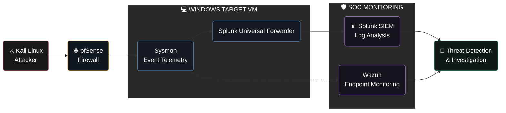

<h3>Cybersecurity Graduate Student @ WGU</h3>

<h1><strong>👋 About Me</strong></h1>

> *"Driven by curiosity, inspired by learning, grounded in kindness, and guided by focus."*

Hi, I'm Kumari Amita Kishore, a cybersecurity graduate student at Western Governors University (WGU), passionate about threat detection, security investigations, and incident response, with a strong interest in strengthening defensive security through hands-on learning and practical problem-solving.

- 🎓 **Advanced Cybersecurity Training:** SANS × WiCyS Scholar (2025–2026), with intensive hands-on training in attack simulations, threat analysis, incident handling, and practical security labs.
- 🏦 **Background:** Former banking professional bringing analytical thinking, problem-solving, and attention to detail into cybersecurity.
- 🎯 **Career Focus:** Security Operations • Threat Detection • Incident Response • Threat Hunting
- 🛡️ **Hands-On Practice:** Exploring SOC operations through home labs, log analysis, and security investigations.
- ☁️ **Cloud Security:** Exploring AWS & Azure through hands-on cloud security and IAM labs.
- 🚩 **CTF Enthusiast:** SANS NetWars • SkillBit (formerly MetaCTF) • National Cyber League (NCL)
- 🌱 **Learning Approach:** Practice consistently, investigate how things work, document findings, and continuously improve.

---

## 🏅 Professional Certifications

### ✅ Earned Certifications

| Issuer | Certification |
|:---|:---|
| GIAC | GIAC Certified Incident Handler (GCIH) |
| GIAC | GIAC Security Essentials (GSEC) |
| GIAC | GIAC Foundational Cybersecurity Technologies (GFACT) |
| CompTIA | CompTIA PenTest+ |
| CompTIA | CompTIA CySA+ |
| ISC2 | Certified in Cybersecurity (CC) |
| AWS | AWS Certified AI Practitioner (AIF-C01) |

### 🎯 Planned Certifications

| Issuer | Certification |
|:---|:---|
| Microsoft | SC-900 — Security, Compliance, and Identity Fundamentals |
| Microsoft | SC-200 — Security Operations Analyst |
| Microsoft | SC-300 — Identity and Access Administrator |
| AWS | AWS Certified Cloud Practitioner (CLF-C02) |
| CompTIA | CompTIA SecAI+ |

---

## 🛠️ Security Toolkit

### 🛡️ Security Operations & Analysis

### 🔬 Digital Forensics & Threat Analysis

### ⚔️ Security Testing & Reconnaissance

### ☁️ Cloud & Identity Security

### 💻 Operating Systems & Scripting

### 📋 Security Frameworks & Compliance

### 🚨 Incident Response Methodologies

---

## 🔬 Hands-On Projects

### 📂 Cybersecurity Lab Documentation
Documenting hands-on labs, security investigations, and practical exercises across defensive security, network analysis, penetration testing, cloud security, and incident response.

Sharing technical approaches, tools, investigation findings, and lessons learned through GitHub repositories.

### 🛡️ SOC Home Lab Architecture

Performing hands-on attack simulations in a virtual SOC environment to explore security monitoring, log collection, threat detection, and incident investigation.

## 🏆 CTFs & Cybersecurity Challenges

Strengthening cybersecurity skills through CTFs, hands-on challenges, and practical problem-solving.

| 🛡️ SANS Core NetWars | 🔐 WiCyS × SANS STS Tier 1 & 2 | 🔥 WiCyS × FLARE Sisterhood | 🔎 Tenable |
|:---:|:---:|:---:|:---:|
| ⚡ SkillBit | 🏁 National Cyber League (NCL) | 🛡️ SentinelOne | 🚀 More Challenges Ahead |

